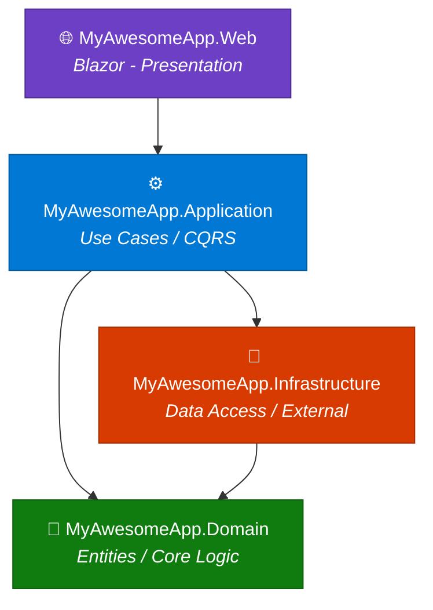
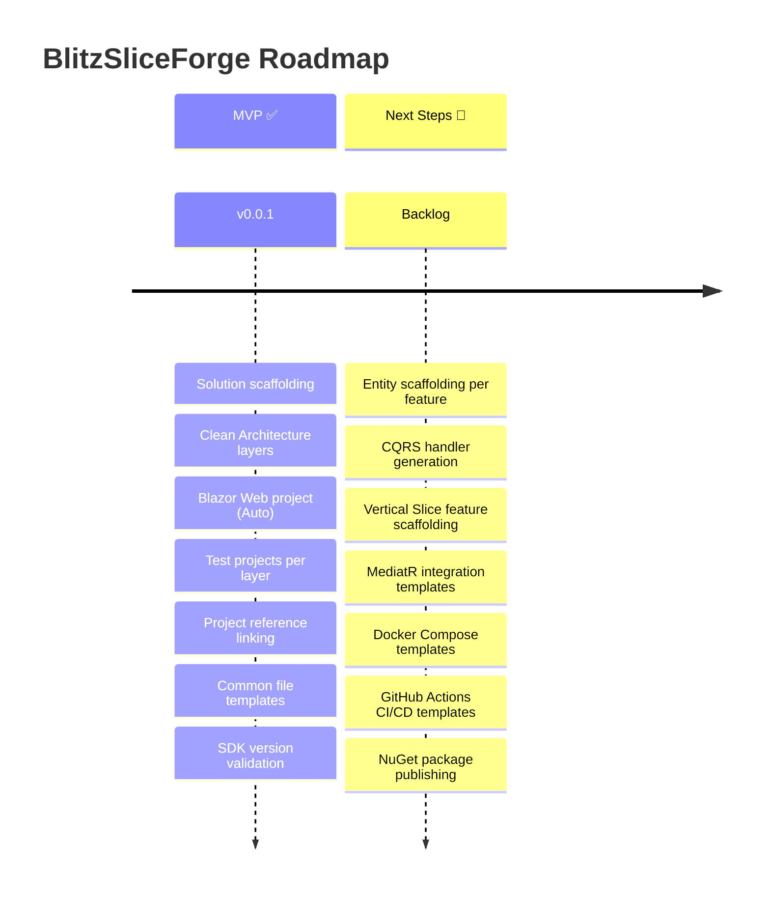

[](https://github.com/AlejBlasco/BlitzSliceForge/actions/workflows/build-and-test.yml)

<p align="center">
  
  
  
  
    
</p>

# ⚡ BlitzSliceForge

> **Fast .NET scaffolder for Blazor + CQRS + Vertical Slice Architecture solutions**

BlitzSliceForge (`bsf`) is a CLI tool that scaffolds a fully structured .NET 9 solution following **Clean Architecture** and **Vertical Slice** principles in seconds. Stop wasting time creating projects, linking references, and setting up folder structures manually — let `bsf` do the heavy lifting.

---

## ✨ Features

- 🚀 **One-command scaffolding** — generates an entire solution structure instantly
- 🏗️ **Clean Architecture** — Domain, Application, Infrastructure, and Web layers out of the box
- 🌐 **Blazor Interactive** — pre-configured Blazor project with `Auto` interactivity mode
- 🧪 **Test projects included** — test projects created and linked for every layer
- 📁 **Opinionated folder layout** — `src/`, `tests/`, `docs/adr/`, `docker/`, `.github/workflows/`
- 📄 **Common files** — `.gitignore`, `global.json`, `Directory.Build.props`, and `README.md` auto-generated
- 🔍 **SDK validation** — verifies the required .NET SDK is installed before scaffolding
- 📦 **Distributed as a .NET tool** — install globally and use anywhere

---

## 📦 Installation

### Prerequisites

- [.NET 9 SDK](https://dotnet.microsoft.com/download/dotnet/9.0) or later

### Install globally
```bash
dotnet tool install --global BlitzSliceForge.Cli
```

### Check installation
```bash
bsf --help

Descripción:
  bsf - Blitz Slice Forge

Uso:
  BlitzSliceForge.Cli [opciones]

Opciones:
  -n, --name <name> (REQUERIDO)  Name of the solution
  -o, --output <output>          Output path (default: solution name)
  -?, -h, --help                 Mostrar ayuda e información de uso
  --version                      Mostrar información de la versión
```

### Uninstall

```bash
dotnet tool uninstall BlitzSliceForge.Cli --tool-path .tools 
```

---

## 🚀 Quick Usage

### Generate a new solution

```bash
bsf --name MyAwesomeApp
```

This creates a solution named `MyAwesomeApp` in a folder with the same name in the current directory.

### Specify a custom output directory

```bash
bsf --name MyAwesomeApp --output C:/Projects/MyAwesomeApp
```

### CLI Options

| Option | Alias | Description | Required |
|---|---|---|---|
| `--name` | `-n` | Name of the solution | ✅ Yes |
| `--output` | `-o` | Output path (defaults to solution name) | ❌ No |

---

## 🏗️ Generated Structure (Work in Progress))

When you run `bsf --name MyAwesomeApp`, the following structure is generated:

```
MyAwesomeApp/
├── .github/
│   └── workflows/           # CI/CD workflow templates
├── docker/                  # Docker configuration
├── docs/
│   └── adr/                 # Architecture Decision Records
├── src/
│   ├── MyAwesomeApp.Domain/             # Entities, Value Objects, Interfaces
│   ├── MyAwesomeApp.Application/        # Use Cases, CQRS Handlers, DTOs
│   ├── MyAwesomeApp.Infrastructure/     # EF Core, External Services, Repos
│   └── MyAwesomeApp.Web/               # Blazor Server/WASM (Auto mode)
├── tests/
│   ├── MyAwesomeApp.Domain/             # Domain unit tests
│   ├── MyAwesomeApp.Application/        # Application unit tests
│   └── MyAwesomeApp.Infrastructure/     # Infrastructure unit tests
├── .gitignore
├── Directory.Build.props
├── global.json
├── README.md
└── MyAwesomeApp.sln
```

### Project References (Work in Progress))

The generated projects are automatically linked following Clean Architecture dependency rules:



> **Application** → references **Domain** + **Infrastructure**
> **Infrastructure** → references **Domain**

---

## 📊 Project Status



### Current Status: `MVP` ✅

| Feature | Status |
|---|---|
| Solution generation | ✅ Done |
| Clean Architecture project layout | ✅ Done |
| Blazor Web project (Auto interactivity) | ✅ Done |
| Test projects for each layer | ✅ Done |
| Automatic project reference linking | ✅ Done |
| Common templates (`.gitignore`, `global.json`, etc.) | ✅ Done |
| .NET SDK validation | ✅ Done |
| Global .NET tool distribution | ✅ Done |

### Next Steps 🔮

| Feature | Status |
|---|---|
| Entity scaffolding per feature/slice | 📋 Planned |
| CQRS command/query handler generation | 📋 Planned |
| Vertical Slice feature folder scaffolding | 📋 Planned |
| MediatR integration templates | 📋 Planned |
| Docker Compose templates | 📋 Planned |
| GitHub Actions CI/CD pipelines | 📋 Planned |

---

## 🛠️ Building from Source

```bash
# Clone the repository
git clone https://github.com/AlejBlasco/BlitzSliceForge.git
cd BlitzSliceForge

# Build the project
dotnet build

# Run locally
dotnet run --project src/BlitzSliceForge.Cli -- --name TestSolution

# Pack as a .NET tool
dotnet pack src/BlitzSliceForge.Cli -c Release

# Install locally from the generated .nupkg
dotnet tool install --global --add-source ./src/BlitzSliceForge.Cli/nupkg BlitzSliceForge.Cli
```

---

## 🧪 Running Tests (Work in Progress))

```bash
dotnet test
```

---

## 📄 License

This project is licensed under the **MIT License** — see the [LICENSE](LICENSE) file for details.

---

## 🤝 Contributing

Contributions are welcome! Feel free to open an issue or submit a pull request.

1. Fork the repository
2. Create your feature branch (`git checkout -b feature/amazing-feature`)
3. Commit your changes (`git commit -m 'Add amazing feature'`)
4. Push to the branch (`git push origin feature/amazing-feature`)
5. Open a Pull Request

---

<p align="center">
  Made with ⚡ by <a href="https://github.com/AlejBlasco">A. Blasco</a>
</p>

